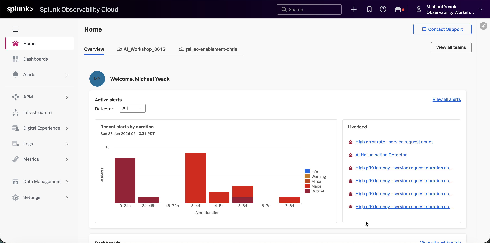
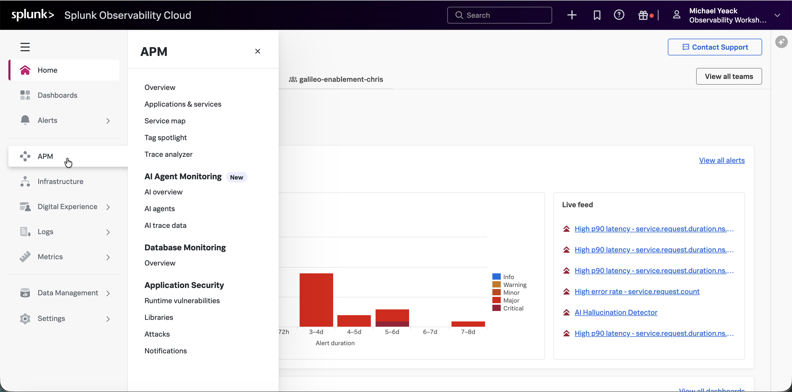
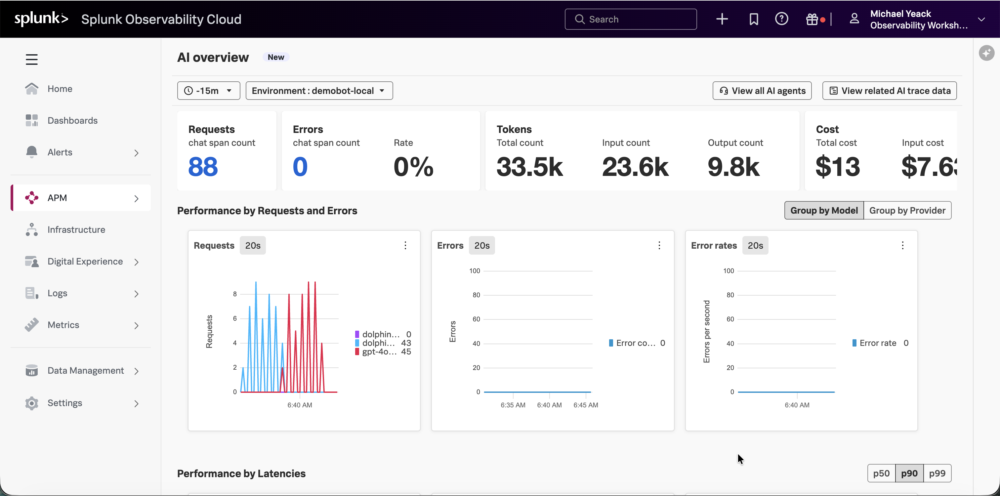
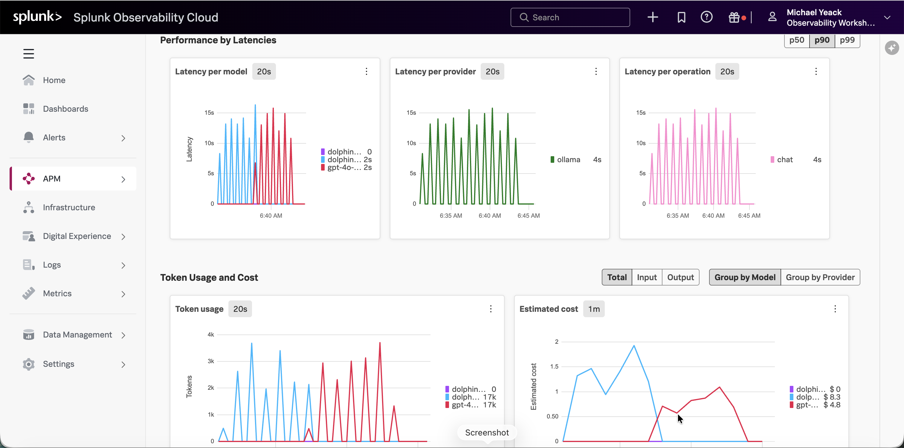
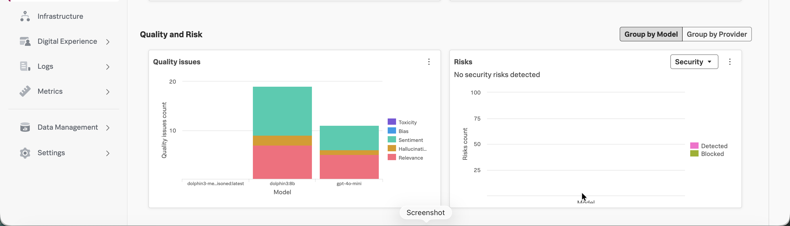
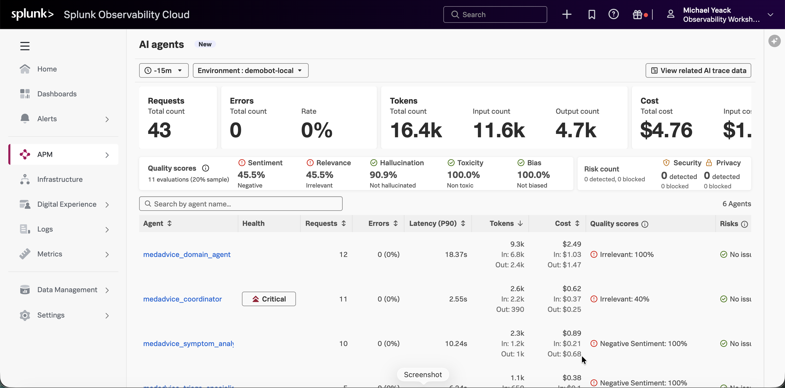
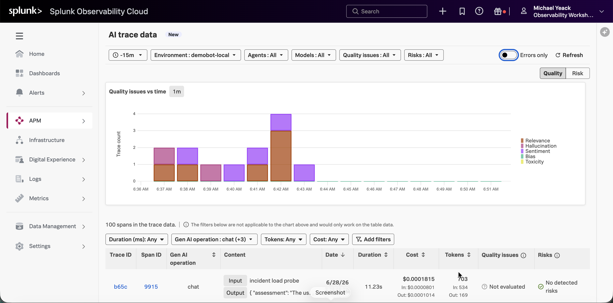

# Lab 3 — OBSERVE (Splunk Observability Cloud)
{: .no_toc }

**Pillar:** Observe 
**Tool:** Splunk Observability Cloud 
**Timing:** 20 minutes 
**Outcome:** Operational Excellence
{: .fs-5 .fw-300 }

<!-- persona:start -->

{: .persona }
> **Who this is for.** **SRE / Observability** and **FinOps** teams, with
> **AI / ML Platform leaders**. Primary question: _Is the AI healthy, fast, and
> affordable in production — and when something breaks, can I trace it to the
> exact agent or request?_ This treats AI as a mission-critical service, monitored
> like any other.

<!-- persona:end -->

1. TOC
{:toc}

---

## Objective

{: .objective }
> After applying the guardrail in Cisco AI Defense, the response is now compliant. However, latency has spiked beyond SLO. Use the Troubleshooting & Remediation Agent to trace the request end-to-end, isolate the bottleneck, and restore performance.

## Background

>>>TBD: Reference Derek Mitchell's lab for deep dive in setup and configuration

## Step by step

### 1. Access Splunk Observability Cloud

Lorem ipsum

### 2. Review Home

Splunk Observability Cloud is the operational health hub for the AI application — it watches the live system the way you'd monitor any mission-critical service, surfacing active alerts, latency, and errors so problems are caught and triaged the moment they happen.

Active alerts — Shows how many issues are firing and how long they've gone unresolved, ranked by severity. The value is instant triage — leadership sees not just that something's wrong, but how serious and how stale, so attention goes where it matters. We will investigate an alert later in this lab.

Live feed — A real-time stream of what's breaking right now, including an AI Hallucination Detector alongside latency and error alerts. The standout point: AI-specific quality failures are monitored in the same operational pane as classic infrastructure problems — AI is treated as core business application, not a science project.

### 3. Review AI Overview

Navigate to APM -> AI Overview.

Select in "demobot-local" Environment.

Generate a few transactions in DemoBot.

AI Overview is the health monitor for the AI application — it tracks performance, reliability, cost, and quality in real time and breaks every number down by model and provider, so teams know not just that the AI works, but which model is fast, cheap, and safe.

Top KPIs (Requests, Errors, Tokens, Cost) — The live vital signs of the application: how much traffic it's serving, how often it's failing, how much it's consuming, and what it's costing. This is the at-a-glance health check that tells an operator the system is up and behaving.

Performance by Requests and Errors — Plots request volume and failures over time, split by model. The value is seeing reliability per model — which one is carrying load and which is throwing errors, side by side.

Performance by Latencies (per model / provider / operation, p50–p99) — Measures response speed at the percentiles that matter, including the slow tail users actually feel. This is the experience metric — proof the AI is responsive, and a precise pointer to which model or step is the bottleneck.

Token Usage and Cost (by model / provider) — Ties consumption directly to dollars, model by model. The value is cost-performance comparison in one view — the evidence to route traffic to the model that delivers the best work per dollar.

Quality and Risk (Quality issues, Risks) — The standout: alongside speed and cost, this grades responses for toxicity, bias, hallucination, and relevance, and watches for security risks. AI-specific failure modes are monitored with the same rigor as latency — quality is an operational metric, not an afterthought.

## 4. Review AI Agents

Click on **View all AI agents**.

The AI agents view is the per-agent scorecard for a multi-agent system — it breaks the application down into the individual AI agents that do the work and grades each one on health, speed, cost, quality, and risk. This is how you govern not just "the AI," but every specialist agent inside it.

Top KPIs (Requests, Errors, Tokens, Cost) — The combined vital signs across all agents: total work served, failure rate, consumption, and spend. The at-a-glance read that the agentic system as a whole is healthy.

Quality scores (Sentiment, Relevance, Hallucination, Toxicity, Bias) — Grades the fleet's output across the dimensions that define a good, safe answer. The value is a single quality posture for the whole system — and an immediate flag on which dimensions are weak.

Risk count (Security, Privacy) — Tracks how many interactions triggered a security or privacy risk, and how many were blocked. This folds the safety question into the same view as performance — one place to confirm the agents aren't leaking or being attacked.

Per-agent table (Agent, Health, Requests, Errors, Latency, Tokens, Cost, Quality, Risks) — The heart of it: every agent ranked side by side on the same measures. This is accountability at the component level — you can see exactly which agent is slow, expensive, or producing poor answers, rather than blaming the system as a whole.

Health flags (Critical) & quality callouts (Irrelevant 100%, Negative Sentiment 100%) — Surfaces the specific failing agents and how they're failing. The value is precise triage — the platform points straight at the coordinator that's critical or the agent returning 100% irrelevant answers.

## 5. Review AI Trace Data

Click on **View related AI trace data**.

The AI trace data view is the forensic layer of observability — it drops from aggregate dashboards down to individual AI interactions, letting a team filter to exactly the problem traces and inspect a single conversation's quality, cost, and risk side by side. This is where "something's wrong" becomes "here's the exact request that caused it."

Quality issues vs. time — Charts when quality problems occurred and of what kind — relevance, hallucination, sentiment, bias, toxicity. The value is pinpointing the moment things degraded and the nature of the failure, so investigation starts with a timestamp and a category, not a guess.

Filters (Environment, Agents, Models, Quality issues, Risks, Errors only) — Narrow the entire flood of traffic to the specific traces that matter — one model, one risk type, errors only. This is what makes a high-volume system investigable: isolate the needle before reading it.

Quality / Risk toggle — Switches the same trace data between a quality lens and a security lens. One dataset, two governance questions — "is it accurate?" and "is it safe?"

Trace table (Trace ID, Span, Operation, Content, Date, Duration, Cost, Tokens, Quality issues, Risks) — The line-item record of individual interactions, each with its actual input/output, what it cost, how long it took, and how it scored. This is the ground truth — every aggregate number on every other dashboard ultimately resolves to a row here.

Per-trace cost & token breakdown (In/Out) — Attributes spend down to a single request, split by input and output. The value is cost accountability at the finest grain — you can see exactly what one conversation cost and why.

## Outcome

- Same platform, same correlation key. The slow turn in APM is the **same** `trace_id` you'd pull up in the audit log — operations, quality, and forensics share one identity.
- A Troubleshooting & Remediation Agent traces end-to-end and points at the bottleneck instead of you grepping logs.
- Cost and latency aren't separate dashboards — Observe shows token usage and latency on the same governed turns Cisco Agent Observability already scored for quality.

APM detectors breach during the ~90s incident; the trace view isolates the slow span; latency returns to ~8s baseline after stop/expiry. The AI Governance Overview Dashboard's Observe latency line shows the spike and recovery.

{: .note }
> The incident is a controlled fault injection against the demo service — safe, time-boxed, and reversible. It does not affect any real workload.

<!-- exec-outcome:start -->

{: .outcome }
> **Executive outcome — Operational Excellence.** Reliable, cost-efficient AI — performance problems are found by tracing, not guessing.

<!-- exec-outcome:end -->

---

[← Lab 2](lab-2-secure.html){: .btn } [Next: Lab 4 — Govern →](lab-4-govern.html){: .btn .btn-primary }
