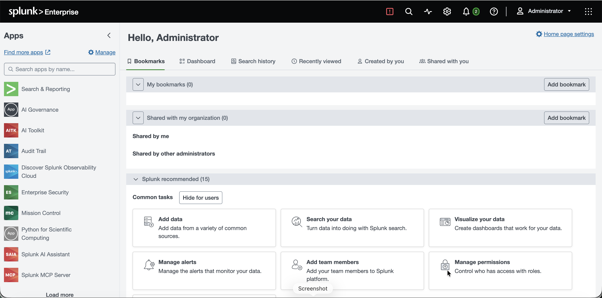
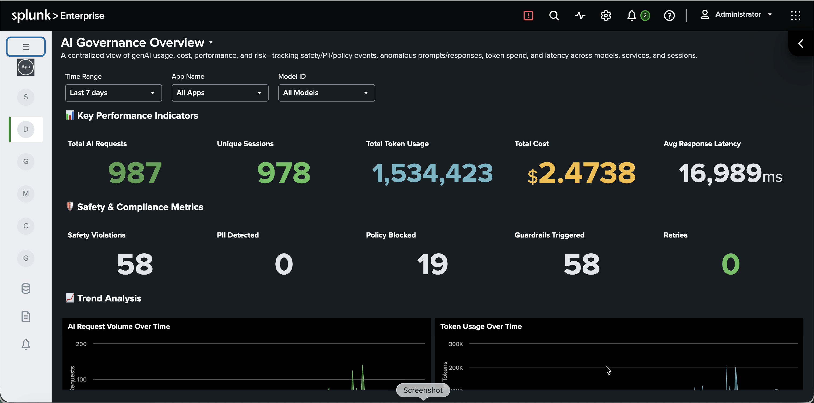
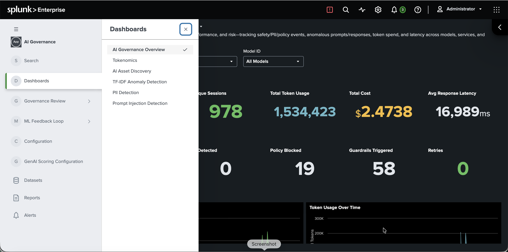

# AI Governance Overview Dashboard: The Single Pane of Glass
{: .no_toc }

**Pillar:** Overview 
**Tool:** Splunk — AI Governance TA 
**Timing:** 10 minutes 
**Outcome:** Unified Visibility & Control
{: .fs-5 .fw-300 }

<!-- persona:start -->

{: .persona }
> **Who this is for.** The **CIO / CTO** and **AI Governance leaders** who need
> the whole AI program on one screen. Primary question: _What is the posture of
> our AI — usage, cost, risk, compliance — and is every number backed by
> evidence?_ Security and Platform leaders use this as their single pane of glass.

<!-- persona:end -->

1. TOC
{:toc}

---

## Objective

{: .objective }
> Establish the thesis: every governed turn and its quality/security scores live in one view, and you drill from there into any pillar.

## Background

Every pillar in this workshop — quality, safety, cost, compliance — depends on one thing first: the data has to exist, in one place, in one shape. That foundation is **Cisco Data Fabric, powered by Splunk**.

Agentic systems emit a constant stream of signals: prompts, responses, tokens, latency, safety events, user and session context. In most organizations that signal is scattered across providers, gateways, and logs — so governance becomes a patchwork of guesses and vibes, not evidence.

Cisco Data Fabric fixes that. It ingests AI telemetry from every model, app, and session — wherever it runs — and normalizes it into one queryable record. The pillars aren't separate tools bolted together; they're different views of that single governed dataset:

- **Visibility** — the Overview dashboard is this data rolled up to board level.
- **Quality & Safety** — a metric and an incident point at the same source of truth.
- **Cost** — every token is attributable to a provider, app, model, user, and session.
- **Compliance** — every headline number traces back to a raw, timestamped event.

One dataset. Every pillar. That's what lets a leader go from a number on the screen to the exact conversation behind it.

## Step by Step

### 1. Access Splunk

Lorem ipsum

### 2. Access AI Governance TA

Expand the left sidecar to view all TAs, and click on **AI Governance**.

### 3. Review AI Governance Overview Dashboard

The AI Governance Overview is the single-pane executive scorecard for AI across the enterprise — it consolidates usage, cost, performance, and risk into board-level numbers, complementing the deep per-conversation analysis with a top-down view spanning every model, app, and session.

Key Performance Indicators (Requests, Sessions, Token Usage, Cost, Latency) — The vital signs of the AI footprint: how much it's used, what it costs, and how fast it responds. These are the figures an executive tracks to know the program is healthy and spend is under control.

Safety & Compliance Metrics (Safety Violations, PII Detected, Policy Blocked, Guardrails Triggered, Retries) — The risk dashboard in one row: how often the AI crossed a line and how often the guardrails caught it. This is the proof that controls are active and working — and a live count of exposure.

Trend Analysis (Request Volume, Token Usage over time) — Plots demand and consumption over time, so growth, spikes, and anomalies are visible at a glance. This is the early-warning view for both cost and unusual activity.

Cost Analysis (Cost Over Time, Cost by Service) — Shows when money is spent and which service drives it. The value is attribution: cost stops being a lump sum and becomes traceable to the application responsible, so spend can be owned and controlled.

Service Analysis (Requests by Service, Performance Comparison) — Ranks services side by side on volume, speed, cost, and tokens. This is how leadership sees which workloads carry the load and which are efficient versus expensive — the basis for optimization decisions.

Model Analysis (Model Usage Statistics) — Breaks activity down by the specific model behind it. The value is a clear inventory of what's running where — essential for governing which models are approved and in use.

Session Analysis (Session Activity) — Drills to the individual user session, with its interactions, cost, tokens, and latency. This is the bridge back to the human experience — letting you trace an anomaly all the way down to a single conversation.

Status & Errors (Status Outcome, Errors by Service) — Shows the mix of successful versus blocked or violating responses, and which service generates the most errors. The value is a clean read on whether the AI is mostly behaving — and a finger pointed at the worst-offending service when it isn't.

Recent AI Requests (Detailed Log) — The raw, timestamped record of individual requests with their model, tokens, cost, and safety flags. This is the ground-truth evidence layer — proof that every headline number traces back to real, inspectable events.

Compliance Summary (Safety Compliance %) — Rolls everything into the one figure leadership and auditors care about: the share of events that passed safely. This is the board-level headline — a defensible, quantified compliance posture rather than an assurance.

### 4. Review Tokenomics Dashboard

Expand the left sidecar, and navigate to Dashboards -> Tokenomics.

The Tokenomics dashboard is the financial-management view of the AI program — it treats agentic systems like any other budgeted line of business, tracking what's spent, who and what is driving it, how efficiently each model converts spend into work, and where cost is heading next.

Key Tokenomics KPIs (Total Cost, Tokens, Requests, Avg Cost/Request, Avg Tokens/Request, Output:Input Ratio) — The headline economics of the AI in one row. These are the unit-cost figures a finance owner uses to know whether AI spend is efficient and under control, not just how big it is.

Spend & Volume Trend (Cost / Tokens over time) — Plots dollars and consumption day by day, separating what goes in from what comes out. The value is seeing cost track demand — and spotting the spikes that warrant a closer look.

Cost Attribution (by Provider, App, Model, User) — Answers "who and what is spending the money," down to the individual user. This is chargeback-grade accountability — the basis for allocating budget, setting limits, and having a fair cost conversation with each team.

Efficiency (Cost per 1K Tokens, Tokens/Second, Output:Input Ratio by Model) — Compares models on price, speed, and productivity. This is the optimization lever: clear evidence for which models deliver the most work per dollar, so the business can steer traffic to the efficient ones.

Top Spenders (Sessions, Conversations, Users) — Surfaces the heaviest consumers of spend. The value is fast identification of outliers — the runaway session or power user that drives a disproportionate share of the bill.

Anomalies & Forecast (Hourly Cost vs. Baseline, Projected 30-Day Spend, Unattributed Cost) — Flags abnormal spend against a learned baseline, projects the month-end bill, and isolates cost that can't be tied to a user. This is forward-looking financial governance — budgeting ahead and catching both surprises and accountability gaps.

## Outcome

The leader sees the entire AI program as a single, trustworthy scorecard — and understands it stands on one unified data foundation, not a patchwork of tools.

- **One pane of glass.** Usage, cost, performance, safety, compliance — every model and session, one screen.
- **Posture at a glance, evidence one click away.** Every number is backed by the raw event beneath it. Governance becomes provable, not asserted.

The takeaway: AI is no longer a black box trusted on faith. It's a measurable, attributable, auditable program.

<!-- exec-outcome:start -->

{: .outcome }
> **Executive outcome - Unified Visibility & Control.** The leader sees the posture of the AI program at a glance — and knows that any number on the screen is one click from the evidence behind it.

<!-- exec-outcome:end -->

---

[Next: Lab 1 — Measure →](lab-1-measure.html){: .btn .btn-primary }
